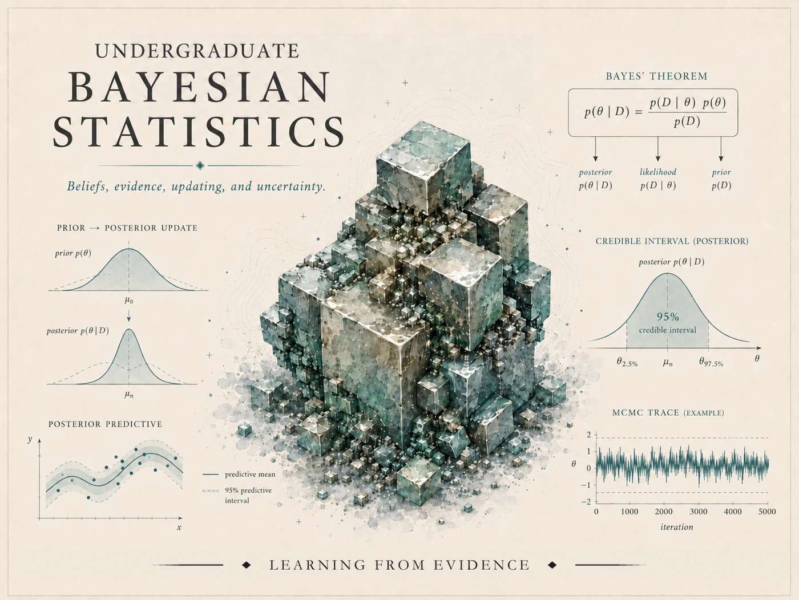

{.course-hero-img fig-alt="Course identity banner for Bayesian Statistics — a teal crystal cluster surrounded by Bayesian graphics: Bayes' theorem, a prior-to-posterior update, a posterior predictive band, a 95% credible interval, and an MCMC trace, with the course title."}

# Bayesian Statistics {.course-landing-title}

::: {.course-landing-subtitle}
Probability, modeling, computation, and evidence
:::

> **A first course in reasoning with uncertainty.** We treat probability as the language of
> uncertainty: before data we describe what is plausible, after data we update that plausibility
> through a likelihood, and then we check whether the resulting model can generate data that look
> like the world. This public site carries the course's instructional notes, labs, and resources.

## What this course is

Bayesian statistics is a coherent framework for reasoning under uncertainty, updating belief with
data, and using models to predict and decide. The course is **applied and computational** but it is
not a software-training course and not a formula-memorization course. Building on introductory
statistics and undergraduate probability, we move from discrete Bayes' rule and diagnostic reasoning
to priors, likelihoods, posteriors, posterior prediction, simple conjugate models, simulation-based
summaries, Bayesian regression, model checking, and introductory hierarchical ideas.

Classical inference appears throughout as a point of comparison — confidence intervals, p-values,
hypothesis tests, regression output — not as a foil, but so you can say clearly what each kind of
statistical statement *means* and what it assumes.

## What you will be able to do

By the end of the term, a student who has done the work should be able to:

- explain Bayesian reasoning as updating uncertainty in light of evidence, and use Bayes' rule in
  discrete settings;
- identify, write, and interpret the **prior, likelihood, posterior, and posterior predictive**
  distributions of an applied model;
- work with simple models — **Beta-Binomial, Gamma-Poisson, Normal** — and summarize posterior
  uncertainty with credible and predictive intervals;
- reason about **prior sensitivity**, check models with **posterior predictive** thinking, and fit
  and interpret basic **Bayesian regression**;
- describe introductory **hierarchical** ideas (partial pooling, shrinkage), compare Bayesian and
  classical summaries responsibly, and communicate results to a non-technical audience;
- produce **reproducible** statistical work with local R, VS Code, and Quarto.

## How the site is organized

- **[Notes](notes/index.qmd)** — the weekly instructional spine, grouped into five parts across the
  15-week term. Each week develops the ideas, works examples, names the common mistakes, and points
  to its reading.
- **[Labs](labs/index.qmd)** — the hands-on, reproducible computation strand (R + Quarto): posterior
  simulation, grid approximation, regression, and partial pooling.
- **[Resources](resources/index.qmd)** — the software setup, a running notation glossary, and a
  Bayes-vs-classical reference.

## Software

The default workflow is a **local install on your own machine**: **R** for computation, **VS Code**
as the editor, and **Quarto** for reproducible reports that combine code, output, graphics, and
written interpretation. No paid platform is required. A limited number of MAC laptops may be
available as a fallback. Setup help lives on the [setup page](resources/r-vscode-quarto-setup.qmd).

## Source and attribution

The primary open text is **[*Bayes Rules! An Introduction to Applied Bayesian Modeling*](https://www.bayesrulesbook.com/)**
by Johnson, Ott, and Dogucu (CC BY-NC-SA 4.0). These notes are the course's **own synthesis**: they
are organized around, and point you to, *Bayes Rules!* and other open readings, but the explanations,
examples, and practice here are written for this course. Adapted material is attributed under the
applicable license; nothing from a source is reproduced wholesale.

## A note on what is public here

This site is **public, ungraded course material**. Graded prompts, rubrics, point values, due dates,
submission instructions, and answer keys are **not** posted here — those live in, and are governed
by, **Blackboard (the LMS)**, which is authoritative for everything graded and operational.

::: {.callout-note appearance="simple"}
**Draft course site.** Topic flow is in place; dates, weights, and final policies are not sealed
and are authoritative in the LMS.
:::
